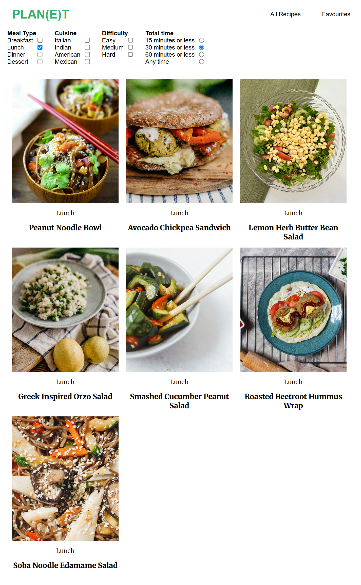
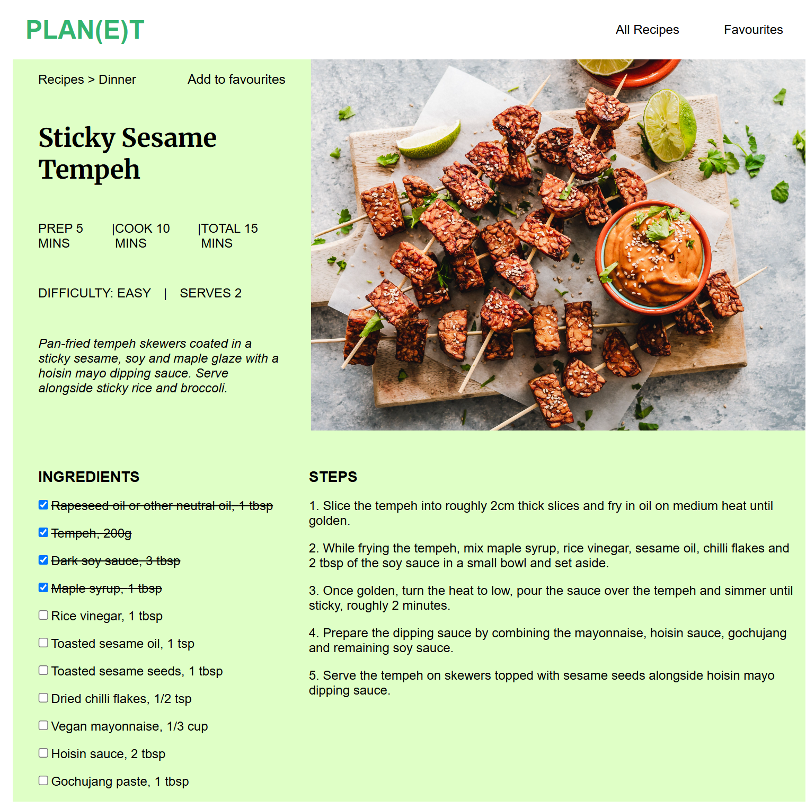
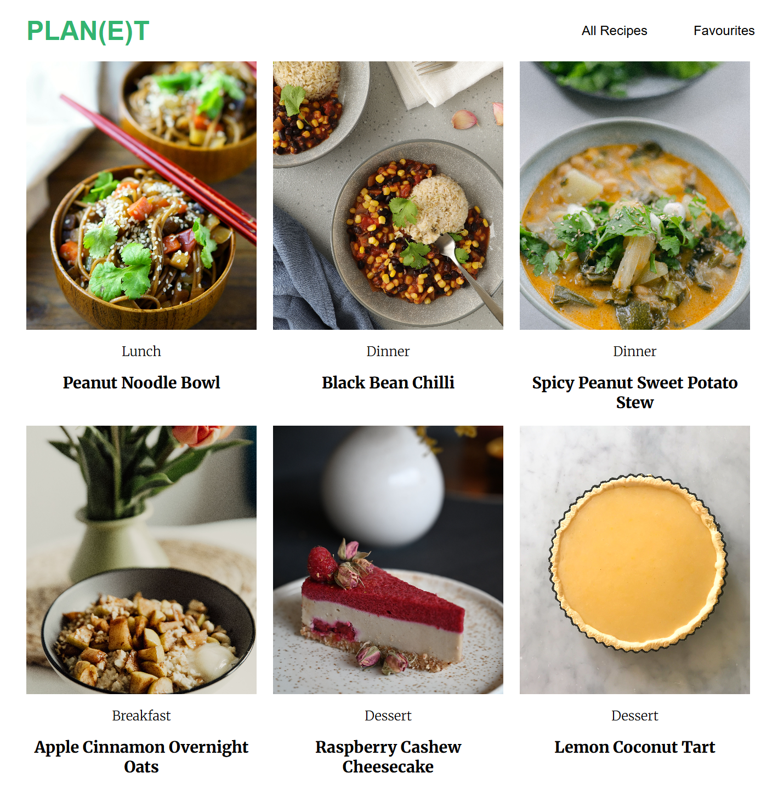

# PLAN(E)T Vegan Recipes

A frontend React + TypeScript recipe app for browsing, filtering, viewing and saving vegan recipes.

## Features

- Browse vegan recipes
- Filter by meal type, cuisine, difficulty and total cooking time
- Recipe detail pages with ingredients and steps
- Save favourites using localStorage
- URL-based filters with React Router

## Tech Stack

- React
- TypeScript
- React Router
- CSS
- Vite

## Links / screenshots

- Repository: [GitHub repo](https://github.com/w-turney/vegan-recipe-app)

### Home page

### Recipes page

### Recipe page

### Favourites page - conservation

---

## Running Locally

npm install
npm run dev

## Notes

This is currently a frontend-only project using mock recipe data.